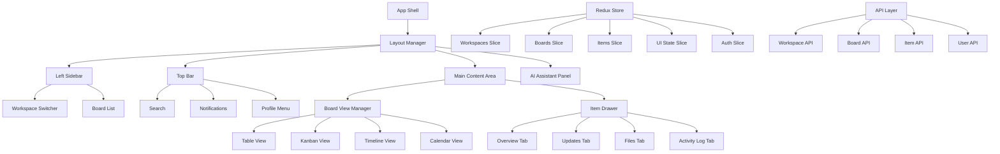
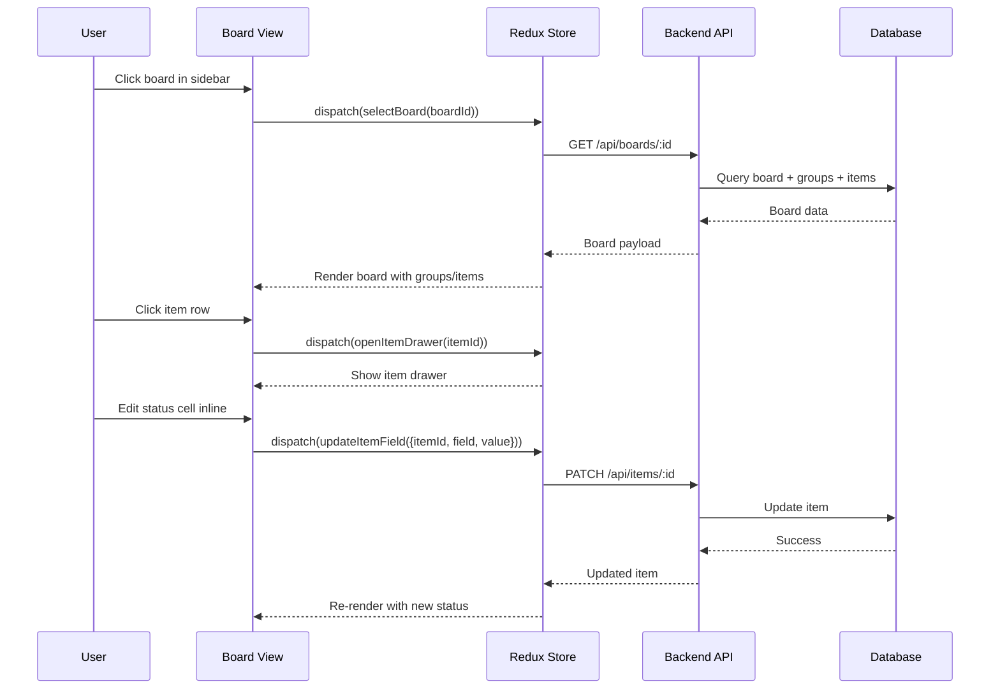
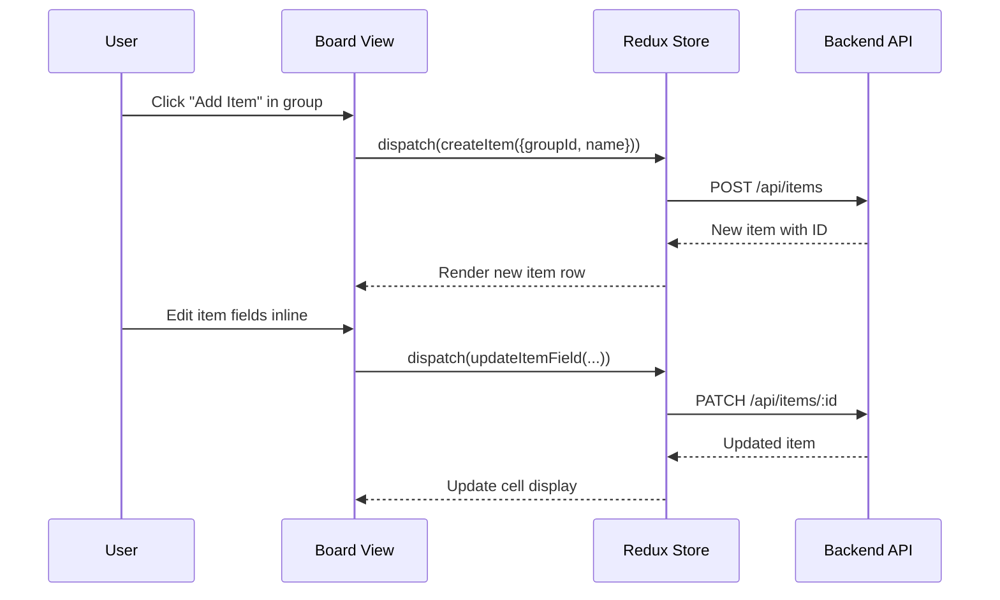

# Design Document: Monday-Style Board Platform

## Overview

This design document outlines a monday.com-style SaaS platform built with a board-first structure. The platform enables teams to manage work across multiple domains (Projects, CRM, Support, HR, Finance) using a unified board interface. The architecture follows a hierarchical data model: Workspaces → Boards → Groups → Items → Updates. The UI features a three-panel layout with a collapsible left sidebar for navigation, a main board area supporting multiple views (Table, Kanban, Timeline, Calendar), and a slide-over item drawer for detailed task management. The system implements role-based access control (Admin/Manager/Employee) and supports inline editing, real-time collaboration features, and an optional AI assistant panel.

The technical stack leverages React with TypeScript for type safety, Material UI or Ant Design for consistent UI components, Redux Toolkit for state management, and React Router for navigation. The design prioritizes modularity, scalability, and maintainability through clear component boundaries and a well-defined data flow architecture.

## Architecture




## Sequence Diagrams

### User Opens Board and Edits Item



### User Adds New Item to Group




## Components and Interfaces

### Component 1: AppShell

**Purpose**: Root layout component that orchestrates the overall UI structure and manages layout state (sidebar collapse, AI panel visibility).

**Interface**:
```typescript
interface AppShellProps {
  children: React.ReactNode;
}

interface AppShellState {
  sidebarCollapsed: boolean;
  aiPanelVisible: boolean;
}

const AppShell: React.FC<AppShellProps> = ({ children }) => {
  // Implementation
};
```

**Responsibilities**:
- Render three-panel layout (sidebar, main content, optional AI panel)
- Manage sidebar collapse/expand state
- Manage AI assistant panel visibility
- Provide layout context to child components

### Component 2: LeftSidebar

**Purpose**: Navigation sidebar containing workspace switcher and board list with RBAC filtering.

**Interface**:
```typescript
interface LeftSidebarProps {
  collapsed: boolean;
  onToggleCollapse: () => void;
}

interface WorkspaceItem {
  id: string;
  name: string;
  icon?: string;
}

interface BoardItem {
  id: string;
  name: string;
  workspaceId: string;
  type: BoardType;
  icon?: string;
}

const LeftSidebar: React.FC<LeftSidebarProps> = (props) => {
  // Implementation
};
```

**Responsibilities**:
- Display workspace switcher dropdown
- Render filtered board list based on user role
- Handle board selection and navigation
- Support collapse/expand animation

### Component 3: TopBar

**Purpose**: Application header with search, notifications, and user profile menu.

**Interface**:
```typescript
interface TopBarProps {
  currentBoard?: Board;
}

interface NotificationItem {
  id: string;
  type: 'mention' | 'assignment' | 'update' | 'system';
  message: string;
  timestamp: Date;
  read: boolean;
  itemId?: string;
}

const TopBar: React.FC<TopBarProps> = ({ currentBoard }) => {
  // Implementation
};
```

**Responsibilities**:
- Render search bar with autocomplete
- Display notification badge and dropdown
- Show user profile menu with role indicator
- Display current board breadcrumb


### Component 4: BoardViewManager

**Purpose**: Manages different board view types (Table, Kanban, Timeline, Calendar) and view switching.

**Interface**:
```typescript
type ViewType = 'table' | 'kanban' | 'timeline' | 'calendar';

interface BoardViewManagerProps {
  boardId: string;
  currentView: ViewType;
  onViewChange: (view: ViewType) => void;
}

const BoardViewManager: React.FC<BoardViewManagerProps> = (props) => {
  // Implementation
};
```

**Responsibilities**:
- Render view selector toolbar
- Switch between view components based on currentView
- Pass board data to appropriate view component
- Maintain view-specific state (zoom level, filters)

### Component 5: TableView

**Purpose**: Default board view displaying groups and items in a table format with inline editing.

**Interface**:
```typescript
interface TableViewProps {
  boardId: string;
  groups: Group[];
  items: Item[];
  columns: ColumnDefinition[];
  onItemClick: (itemId: string) => void;
  onCellEdit: (itemId: string, field: string, value: any) => void;
  onAddItem: (groupId: string) => void;
  onAddGroup: () => void;
}

interface ColumnDefinition {
  id: string;
  name: string;
  type: 'text' | 'status' | 'person' | 'date' | 'priority' | 'tags';
  width: number;
  editable: boolean;
}

const TableView: React.FC<TableViewProps> = (props) => {
  // Implementation
};
```

**Responsibilities**:
- Render groups as collapsible sections
- Display items as table rows with editable cells
- Handle inline cell editing with appropriate editors
- Support "Add Item" and "Add Group" actions
- Implement row selection and bulk actions

### Component 6: ItemDrawer

**Purpose**: Slide-over panel displaying detailed item information with tabs for Overview, Updates, Files, and Activity.

**Interface**:
```typescript
interface ItemDrawerProps {
  itemId: string | null;
  open: boolean;
  onClose: () => void;
}

type DrawerTab = 'overview' | 'updates' | 'files' | 'activity';

const ItemDrawer: React.FC<ItemDrawerProps> = (props) => {
  // Implementation
};
```

**Responsibilities**:
- Render slide-over drawer with smooth animation
- Display tabbed interface for item details
- Load and display item data from Redux store
- Handle tab switching
- Support closing via backdrop click or close button


### Component 7: InlineCellEditor

**Purpose**: Reusable component for inline editing of different cell types (text, status, date, person, priority, tags).

**Interface**:
```typescript
interface InlineCellEditorProps {
  value: any;
  type: ColumnDefinition['type'];
  editable: boolean;
  onSave: (newValue: any) => void;
  onCancel: () => void;
}

const InlineCellEditor: React.FC<InlineCellEditorProps> = (props) => {
  // Implementation
};
```

**Responsibilities**:
- Render appropriate editor based on cell type
- Handle edit mode activation (click or double-click)
- Validate input before saving
- Support keyboard shortcuts (Enter to save, Esc to cancel)
- Display loading state during save operation

### Component 8: KanbanView

**Purpose**: Kanban board view organizing items by status column with drag-and-drop support.

**Interface**:
```typescript
interface KanbanViewProps {
  boardId: string;
  groups: Group[];
  items: Item[];
  statusColumn: ColumnDefinition;
  onItemMove: (itemId: string, newStatus: string) => void;
  onItemClick: (itemId: string) => void;
}

interface KanbanColumn {
  id: string;
  title: string;
  color: string;
  items: Item[];
}

const KanbanView: React.FC<KanbanViewProps> = (props) => {
  // Implementation
};
```

**Responsibilities**:
- Organize items into columns by status
- Implement drag-and-drop for item movement
- Display item cards with key information
- Support adding new items to columns
- Handle column scrolling for long lists


## Data Models

### Model 1: Workspace

```typescript
interface Workspace {
  id: string;
  name: string;
  description?: string;
  icon?: string;
  ownerId: string;
  createdAt: Date;
  updatedAt: Date;
  members: WorkspaceMember[];
}

interface WorkspaceMember {
  userId: string;
  role: UserRole;
  joinedAt: Date;
}

type UserRole = 'admin' | 'manager' | 'employee';
```

**Validation Rules**:
- `name` must be non-empty string (1-100 characters)
- `id` must be unique UUID
- `ownerId` must reference valid user
- At least one member must have 'admin' role

### Model 2: Board

```typescript
type BoardType = 'project' | 'crm' | 'support' | 'hr' | 'finance';

interface Board {
  id: string;
  name: string;
  description?: string;
  type: BoardType;
  workspaceId: string;
  icon?: string;
  color?: string;
  columns: ColumnDefinition[];
  defaultView: ViewType;
  createdBy: string;
  createdAt: Date;
  updatedAt: Date;
  permissions: BoardPermissions;
}

interface BoardPermissions {
  viewerRoles: UserRole[];
  editorRoles: UserRole[];
  adminRoles: UserRole[];
}

interface ColumnDefinition {
  id: string;
  name: string;
  type: 'text' | 'status' | 'person' | 'date' | 'priority' | 'tags';
  width: number;
  editable: boolean;
  required: boolean;
  options?: ColumnOption[];
  defaultValue?: any;
}

interface ColumnOption {
  id: string;
  label: string;
  color?: string;
}
```

**Validation Rules**:
- `name` must be non-empty string (1-100 characters)
- `workspaceId` must reference valid workspace
- `columns` must include at least one column with type 'text' for item name
- `type` must be one of the defined BoardType values
- Status columns must have at least 2 options defined


### Model 3: Group

```typescript
interface Group {
  id: string;
  name: string;
  boardId: string;
  color?: string;
  position: number;
  collapsed: boolean;
  createdAt: Date;
  updatedAt: Date;
}
```

**Validation Rules**:
- `name` must be non-empty string (1-100 characters)
- `boardId` must reference valid board
- `position` must be non-negative integer
- Groups within same board must have unique positions

### Model 4: Item

```typescript
interface Item {
  id: string;
  name: string;
  groupId: string;
  boardId: string;
  position: number;
  fields: Record<string, any>;
  createdBy: string;
  createdAt: Date;
  updatedAt: Date;
  assignees: string[];
}

// Example fields structure based on column definitions
interface ItemFields {
  status?: string;
  assignee?: string;
  dueDate?: Date;
  priority?: 'low' | 'medium' | 'high' | 'critical';
  tags?: string[];
  [key: string]: any;
}
```

**Validation Rules**:
- `name` must be non-empty string (1-200 characters)
- `groupId` must reference valid group
- `boardId` must reference valid board
- `position` must be non-negative integer
- `fields` keys must match board column IDs
- Required fields (per column definition) must be present
- Field values must match column type constraints

### Model 5: Update

```typescript
interface Update {
  id: string;
  itemId: string;
  userId: string;
  content: string;
  type: 'comment' | 'system';
  createdAt: Date;
  updatedAt: Date;
  mentions: string[];
  attachments: Attachment[];
  reactions: Reaction[];
}

interface Attachment {
  id: string;
  name: string;
  url: string;
  size: number;
  mimeType: string;
  uploadedAt: Date;
}

interface Reaction {
  emoji: string;
  userId: string;
  createdAt: Date;
}
```

**Validation Rules**:
- `content` must be non-empty for comment type
- `itemId` must reference valid item
- `userId` must reference valid user
- `mentions` must reference valid user IDs
- Attachment size must not exceed configured limit


### Model 6: User

```typescript
interface User {
  id: string;
  email: string;
  name: string;
  avatar?: string;
  role: UserRole;
  workspaces: string[];
  preferences: UserPreferences;
  createdAt: Date;
  lastLoginAt: Date;
}

interface UserPreferences {
  theme: 'light' | 'dark';
  defaultView: ViewType;
  notifications: NotificationSettings;
  language: string;
}

interface NotificationSettings {
  email: boolean;
  push: boolean;
  mentions: boolean;
  assignments: boolean;
  updates: boolean;
}
```

**Validation Rules**:
- `email` must be valid email format and unique
- `name` must be non-empty string (1-100 characters)
- `role` must be one of defined UserRole values
- `workspaces` must reference valid workspace IDs


## Algorithmic Pseudocode

### Main Board Loading Algorithm

```typescript
async function loadBoard(boardId: string): Promise<void> {
  // INPUT: boardId - unique identifier for board
  // OUTPUT: void (updates Redux store)
  // PRECONDITION: boardId is valid UUID, user has view permission
  // POSTCONDITION: Redux store contains board, groups, and items data
  
  try {
    // Step 1: Set loading state
    dispatch(setBoardLoading(true));
    
    // Step 2: Fetch board data with related entities
    const boardData = await api.get(`/api/boards/${boardId}`, {
      include: ['groups', 'items', 'columns']
    });
    
    // Step 3: Validate board data structure
    if (!validateBoardData(boardData)) {
      throw new Error('Invalid board data structure');
    }
    
    // Step 4: Normalize and store in Redux
    const normalized = normalizeBoardData(boardData);
    dispatch(setBoardData(normalized));
    
    // Step 5: Set active board
    dispatch(setActiveBoard(boardId));
    
    // Step 6: Clear loading state
    dispatch(setBoardLoading(false));
    
  } catch (error) {
    dispatch(setBoardError(error.message));
    dispatch(setBoardLoading(false));
  }
}
```

**Preconditions:**
- `boardId` is a valid UUID string
- User is authenticated and has view permission for the board
- API endpoint is available and responsive

**Postconditions:**
- Redux store contains complete board data (board, groups, items)
- Active board is set to the loaded board
- Loading state is false
- If error occurs, error state is set with descriptive message

**Loop Invariants:** N/A (no loops in main flow)


### Inline Cell Edit Algorithm

```typescript
async function handleCellEdit(
  itemId: string,
  field: string,
  newValue: any,
  columnDef: ColumnDefinition
): Promise<boolean> {
  // INPUT: itemId, field name, new value, column definition
  // OUTPUT: boolean indicating success
  // PRECONDITION: User has edit permission, field exists in board columns
  // POSTCONDITION: Item field updated in store and backend, or error displayed
  
  try {
    // Step 1: Validate new value against column type
    const validationResult = validateFieldValue(newValue, columnDef);
    if (!validationResult.valid) {
      dispatch(showError(validationResult.error));
      return false;
    }
    
    // Step 2: Optimistically update UI
    dispatch(updateItemFieldOptimistic({
      itemId,
      field,
      value: newValue
    }));
    
    // Step 3: Send update to backend
    const response = await api.patch(`/api/items/${itemId}`, {
      field,
      value: newValue
    });
    
    // Step 4: Confirm update with server response
    dispatch(updateItemFieldSuccess({
      itemId,
      field,
      value: response.data.fields[field],
      updatedAt: response.data.updatedAt
    }));
    
    // Step 5: Create activity log entry
    dispatch(addActivityLog({
      itemId,
      type: 'field_update',
      field,
      oldValue: getCurrentFieldValue(itemId, field),
      newValue: response.data.fields[field]
    }));
    
    return true;
    
  } catch (error) {
    // Rollback optimistic update
    dispatch(updateItemFieldFailure({
      itemId,
      field,
      error: error.message
    }));
    
    dispatch(showError('Failed to update field'));
    return false;
  }
}
```

**Preconditions:**
- `itemId` references an existing item in the store
- `field` is a valid column ID in the board's column definitions
- User has edit permission for the board
- `columnDef` matches the field being edited

**Postconditions:**
- On success: Item field is updated in Redux store and backend
- On success: Activity log entry is created
- On failure: Optimistic update is rolled back
- On failure: Error message is displayed to user
- UI reflects the final state (success or rollback)

**Loop Invariants:** N/A (no loops in main flow)


### RBAC Permission Check Algorithm

```typescript
function checkBoardPermission(
  user: User,
  board: Board,
  action: 'view' | 'edit' | 'admin'
): boolean {
  // INPUT: user object, board object, requested action
  // OUTPUT: boolean indicating if user has permission
  // PRECONDITION: user and board are valid objects
  // POSTCONDITION: Returns true if user has permission, false otherwise
  
  // Step 1: Check if user is workspace member
  const workspace = getWorkspace(board.workspaceId);
  const membership = workspace.members.find(m => m.userId === user.id);
  
  if (!membership) {
    return false;
  }
  
  // Step 2: Get user's role in workspace
  const userRole = membership.role;
  
  // Step 3: Check permission based on action and board permissions
  switch (action) {
    case 'view':
      return board.permissions.viewerRoles.includes(userRole);
    
    case 'edit':
      return board.permissions.editorRoles.includes(userRole);
    
    case 'admin':
      return board.permissions.adminRoles.includes(userRole);
    
    default:
      return false;
  }
}
```

**Preconditions:**
- `user` is a valid User object with id and role
- `board` is a valid Board object with permissions defined
- `action` is one of: 'view', 'edit', 'admin'
- Workspace exists and is accessible

**Postconditions:**
- Returns `true` if user has the requested permission
- Returns `false` if user lacks permission or is not workspace member
- No side effects or state mutations

**Loop Invariants:** N/A (no loops)


### Item Reordering Algorithm (Drag and Drop)

```typescript
async function reorderItem(
  itemId: string,
  targetGroupId: string,
  targetPosition: number
): Promise<void> {
  // INPUT: item to move, target group, target position
  // OUTPUT: void (updates store and backend)
  // PRECONDITION: itemId exists, targetGroupId exists, targetPosition >= 0
  // POSTCONDITION: Item moved to new position, all positions recalculated
  
  try {
    const item = getItem(itemId);
    const sourceGroupId = item.groupId;
    
    // Step 1: Calculate new positions for affected items
    const affectedItems = calculateAffectedItems(
      itemId,
      sourceGroupId,
      targetGroupId,
      targetPosition
    );
    
    // Step 2: Optimistically update UI
    dispatch(reorderItemOptimistic({
      itemId,
      targetGroupId,
      targetPosition,
      affectedItems
    }));
    
    // Step 3: Send batch update to backend
    const updates = affectedItems.map(item => ({
      id: item.id,
      groupId: item.groupId,
      position: item.position
    }));
    
    await api.post('/api/items/batch-update', { updates });
    
    // Step 4: Confirm success
    dispatch(reorderItemSuccess());
    
  } catch (error) {
    // Rollback optimistic update
    dispatch(reorderItemFailure());
    dispatch(showError('Failed to reorder item'));
  }
}

function calculateAffectedItems(
  itemId: string,
  sourceGroupId: string,
  targetGroupId: string,
  targetPosition: number
): Item[] {
  // LOOP INVARIANT: All processed items have correct sequential positions
  
  const affectedItems: Item[] = [];
  
  if (sourceGroupId === targetGroupId) {
    // Moving within same group
    const groupItems = getItemsByGroup(sourceGroupId);
    const item = groupItems.find(i => i.id === itemId);
    const oldPosition = item.position;
    
    // Reposition items between old and new position
    for (let i = 0; i < groupItems.length; i++) {
      const currentItem = groupItems[i];
      
      if (currentItem.id === itemId) {
        affectedItems.push({ ...currentItem, position: targetPosition });
      } else if (oldPosition < targetPosition) {
        // Moving down: shift items up
        if (currentItem.position > oldPosition && currentItem.position <= targetPosition) {
          affectedItems.push({ ...currentItem, position: currentItem.position - 1 });
        }
      } else {
        // Moving up: shift items down
        if (currentItem.position >= targetPosition && currentItem.position < oldPosition) {
          affectedItems.push({ ...currentItem, position: currentItem.position + 1 });
        }
      }
    }
  } else {
    // Moving to different group
    const sourceItems = getItemsByGroup(sourceGroupId);
    const targetItems = getItemsByGroup(targetGroupId);
    
    // Update source group: close gap
    for (let i = 0; i < sourceItems.length; i++) {
      const currentItem = sourceItems[i];
      if (currentItem.id === itemId) {
        affectedItems.push({
          ...currentItem,
          groupId: targetGroupId,
          position: targetPosition
        });
      } else if (currentItem.position > getItem(itemId).position) {
        affectedItems.push({ ...currentItem, position: currentItem.position - 1 });
      }
    }
    
    // Update target group: make space
    for (let i = 0; i < targetItems.length; i++) {
      const currentItem = targetItems[i];
      if (currentItem.position >= targetPosition) {
        affectedItems.push({ ...currentItem, position: currentItem.position + 1 });
      }
    }
  }
  
  return affectedItems;
}
```

**Preconditions:**
- `itemId` references an existing item
- `targetGroupId` references an existing group in the same board
- `targetPosition` is a non-negative integer
- User has edit permission for the board

**Postconditions:**
- Item is moved to target group at target position
- All affected items have updated positions maintaining sequential order
- No gaps in position sequences within groups
- Backend is synchronized with UI state

**Loop Invariants:**
- In calculateAffectedItems loops: All previously processed items have correct sequential positions
- Position values remain non-negative throughout
- No duplicate positions within a group


## Key Functions with Formal Specifications

### Function 1: validateFieldValue()

```typescript
function validateFieldValue(
  value: any,
  columnDef: ColumnDefinition
): { valid: boolean; error?: string } {
  // Validates field value against column definition constraints
}
```

**Preconditions:**
- `columnDef` is a valid ColumnDefinition object
- `columnDef.type` is one of the supported column types

**Postconditions:**
- Returns object with `valid: true` if value passes all validation rules
- Returns object with `valid: false` and descriptive `error` message if validation fails
- No mutations to input parameters
- Validation is deterministic (same inputs always produce same output)

**Loop Invariants:** N/A

### Function 2: normalizeBoardData()

```typescript
function normalizeBoardData(boardData: any): NormalizedBoardData {
  // Transforms nested board data into normalized Redux store structure
}
```

**Preconditions:**
- `boardData` contains valid board object with nested groups and items
- All entities have unique IDs

**Postconditions:**
- Returns normalized data structure with separate entities maps
- All relationships preserved via ID references
- No data loss during normalization
- Result structure matches Redux store schema

**Loop Invariants:**
- For groups loop: All processed groups are added to normalized.groups map
- For items loop: All processed items are added to normalized.items map
- All entity IDs remain unique throughout processing

### Function 3: filterBoardsByRole()

```typescript
function filterBoardsByRole(
  boards: Board[],
  userRole: UserRole
): Board[] {
  // Filters board list based on user's role permissions
}
```

**Preconditions:**
- `boards` is an array of valid Board objects
- `userRole` is one of: 'admin', 'manager', 'employee'

**Postconditions:**
- Returns array containing only boards where user has view permission
- Original boards array is not mutated
- Result maintains original board order
- Empty array returned if no boards match permissions

**Loop Invariants:**
- All boards in result array have passed permission check
- Result array length ≤ input array length


### Function 4: createNewItem()

```typescript
async function createNewItem(
  groupId: string,
  name: string,
  initialFields?: Partial<ItemFields>
): Promise<Item> {
  // Creates new item in specified group with optional initial field values
}
```

**Preconditions:**
- `groupId` references an existing group
- `name` is non-empty string (1-200 characters)
- User has edit permission for the board
- `initialFields` keys (if provided) match board column IDs

**Postconditions:**
- New item is created with unique ID
- Item is added to Redux store and backend
- Item position is set to end of group (max position + 1)
- Required fields are populated (from initialFields or defaults)
- Activity log entry is created
- Returns the created Item object

**Loop Invariants:** N/A

### Function 5: searchItems()

```typescript
function searchItems(
  query: string,
  boards: Board[],
  items: Item[]
): SearchResult[] {
  // Searches items across multiple boards by name and field values
}
```

**Preconditions:**
- `query` is non-empty string
- `boards` and `items` are valid arrays
- User has view permission for all boards in search scope

**Postconditions:**
- Returns array of SearchResult objects matching query
- Results are ranked by relevance (exact matches first)
- Results include board and group context
- Maximum 50 results returned
- Search is case-insensitive

**Loop Invariants:**
- For boards loop: All processed boards have been searched
- For items loop: All matching items have been added to results
- Result count never exceeds maximum limit

### Function 6: addUpdateToItem()

```typescript
async function addUpdateToItem(
  itemId: string,
  content: string,
  mentions: string[]
): Promise<Update> {
  // Adds comment/update to item with mention notifications
}
```

**Preconditions:**
- `itemId` references an existing item
- `content` is non-empty string
- `mentions` contains valid user IDs
- User has view permission for the item's board

**Postconditions:**
- Update is created and added to item
- Mentioned users receive notifications
- Activity log entry is created
- Returns the created Update object
- Item's updatedAt timestamp is refreshed

**Loop Invariants:**
- For mentions loop: All processed users have received notifications


## Example Usage

### Example 1: Loading and Displaying a Board

```typescript
// In BoardPage component
import { useEffect } from 'react';
import { useDispatch, useSelector } from 'react-redux';
import { loadBoard } from './store/boardSlice';
import { TableView } from './components/TableView';

function BoardPage({ boardId }: { boardId: string }) {
  const dispatch = useDispatch();
  const { board, groups, items, loading, error } = useSelector(
    state => state.boards
  );
  
  useEffect(() => {
    dispatch(loadBoard(boardId));
  }, [boardId, dispatch]);
  
  if (loading) return <LoadingSpinner />;
  if (error) return <ErrorMessage message={error} />;
  if (!board) return <NotFound />;
  
  return (
    <TableView
      boardId={board.id}
      groups={groups}
      items={items}
      columns={board.columns}
      onItemClick={(itemId) => dispatch(openItemDrawer(itemId))}
      onCellEdit={(itemId, field, value) => 
        dispatch(updateItemField({ itemId, field, value }))
      }
      onAddItem={(groupId) => dispatch(createItem({ groupId }))}
      onAddGroup={() => dispatch(createGroup({ boardId }))}
    />
  );
}
```

### Example 2: Inline Cell Editing

```typescript
// In InlineCellEditor component
function InlineCellEditor({ value, type, onSave, onCancel }: InlineCellEditorProps) {
  const [editMode, setEditMode] = useState(false);
  const [editValue, setEditValue] = useState(value);
  
  const handleSave = async () => {
    const success = await onSave(editValue);
    if (success) {
      setEditMode(false);
    }
  };
  
  const handleKeyDown = (e: React.KeyboardEvent) => {
    if (e.key === 'Enter') {
      handleSave();
    } else if (e.key === 'Escape') {
      setEditValue(value);
      setEditMode(false);
      onCancel();
    }
  };
  
  if (!editMode) {
    return (
      <div onClick={() => setEditMode(true)}>
        {renderCellValue(value, type)}
      </div>
    );
  }
  
  return (
    <input
      type="text"
      value={editValue}
      onChange={(e) => setEditValue(e.target.value)}
      onKeyDown={handleKeyDown}
      onBlur={handleSave}
      autoFocus
    />
  );
}
```

### Example 3: RBAC Permission Check

```typescript
// In BoardList component
function BoardList() {
  const user = useSelector(state => state.auth.user);
  const allBoards = useSelector(state => state.boards.list);
  
  // Filter boards based on user role
  const visibleBoards = useMemo(() => {
    return allBoards.filter(board => 
      checkBoardPermission(user, board, 'view')
    );
  }, [allBoards, user]);
  
  return (
    <div>
      {visibleBoards.map(board => (
        <BoardListItem
          key={board.id}
          board={board}
          canEdit={checkBoardPermission(user, board, 'edit')}
          canAdmin={checkBoardPermission(user, board, 'admin')}
        />
      ))}
    </div>
  );
}
```

### Example 4: Adding Update with Mentions

```typescript
// In UpdatesTab component
function UpdatesTab({ itemId }: { itemId: string }) {
  const [content, setContent] = useState('');
  const [mentions, setMentions] = useState<string[]>([]);
  const dispatch = useDispatch();
  
  const handleSubmit = async () => {
    if (!content.trim()) return;
    
    await dispatch(addUpdateToItem({
      itemId,
      content,
      mentions
    }));
    
    setContent('');
    setMentions([]);
  };
  
  const handleMention = (userId: string) => {
    setMentions([...mentions, userId]);
    setContent(content + `@${getUserName(userId)} `);
  };
  
  return (
    <div>
      <UpdatesList itemId={itemId} />
      <textarea
        value={content}
        onChange={(e) => setContent(e.target.value)}
        placeholder="Write an update..."
      />
      <MentionPicker onSelect={handleMention} />
      <button onClick={handleSubmit}>Post Update</button>
    </div>
  );
}
```

### Example 5: Drag and Drop Item Reordering

```typescript
// In TableView component with react-beautiful-dnd
import { DragDropContext, Droppable, Draggable } from 'react-beautiful-dnd';

function TableView({ groups, items, onReorder }: TableViewProps) {
  const handleDragEnd = (result: DropResult) => {
    if (!result.destination) return;
    
    const itemId = result.draggableId;
    const targetGroupId = result.destination.droppableId;
    const targetPosition = result.destination.index;
    
    dispatch(reorderItem(itemId, targetGroupId, targetPosition));
  };
  
  return (
    <DragDropContext onDragEnd={handleDragEnd}>
      {groups.map(group => (
        <Droppable key={group.id} droppableId={group.id}>
          {(provided) => (
            <div ref={provided.innerRef} {...provided.droppableProps}>
              {getItemsByGroup(group.id).map((item, index) => (
                <Draggable key={item.id} draggableId={item.id} index={index}>
                  {(provided) => (
                    <div
                      ref={provided.innerRef}
                      {...provided.draggableProps}
                      {...provided.dragHandleProps}
                    >
                      <ItemRow item={item} />
                    </div>
                  )}
                </Draggable>
              ))}
              {provided.placeholder}
            </div>
          )}
        </Droppable>
      ))}
    </DragDropContext>
  );
}
```


## Correctness Properties

### Property 1: Data Consistency

**Universal Quantification:**
```
∀ item ∈ Items: item.boardId = getGroup(item.groupId).boardId
```

All items must belong to groups that are in the same board. This ensures referential integrity across the hierarchy.

**Test Approach:** Property-based test generating random items and groups, verifying board ID consistency.

### Property 2: Unique Positions Within Groups

**Universal Quantification:**
```
∀ group ∈ Groups, ∀ i, j ∈ getItemsByGroup(group.id):
  i ≠ j ⟹ i.position ≠ j.position
```

Within any group, no two items can have the same position value.

**Test Approach:** Property-based test generating groups with multiple items, verifying position uniqueness.

### Property 3: Sequential Positions

**Universal Quantification:**
```
∀ group ∈ Groups:
  let items = sortBy(getItemsByGroup(group.id), 'position')
  ⟹ items[0].position = 0 ∧ 
    ∀ i ∈ [0, items.length - 1): items[i+1].position = items[i].position + 1
```

Item positions within a group must be sequential starting from 0 with no gaps.

**Test Approach:** Unit tests after reorder operations, property-based tests for batch operations.

### Property 4: RBAC Permission Consistency

**Universal Quantification:**
```
∀ user ∈ Users, ∀ board ∈ Boards:
  checkBoardPermission(user, board, 'admin') ⟹ 
    checkBoardPermission(user, board, 'edit') ∧
    checkBoardPermission(user, board, 'view')
```

Permission hierarchy must be maintained: admin implies edit and view, edit implies view.

**Test Approach:** Property-based test with random user roles and board permissions.

### Property 5: Field Value Type Consistency

**Universal Quantification:**
```
∀ item ∈ Items, ∀ field ∈ item.fields:
  let columnDef = getColumnDefinition(item.boardId, field)
  ⟹ validateFieldValue(item.fields[field], columnDef).valid = true
```

All item field values must conform to their column type definitions.

**Test Approach:** Property-based test generating random field values, validating against column definitions.

### Property 6: Optimistic Update Rollback

**Universal Quantification:**
```
∀ operation ∈ OptimisticOperations:
  let stateBefore = getState()
  operation.execute()
  if operation.fails() then
    getState() = stateBefore
```

If an optimistic update fails, the state must be rolled back to its previous value.

**Test Approach:** Integration tests simulating API failures, verifying state rollback.

### Property 7: Mention Notification Delivery

**Universal Quantification:**
```
∀ update ∈ Updates, ∀ userId ∈ update.mentions:
  ∃ notification ∈ getNotifications(userId):
    notification.updateId = update.id ∧
    notification.type = 'mention'
```

Every mentioned user must receive a notification for the update.

**Test Approach:** Integration tests creating updates with mentions, verifying notification creation.

### Property 8: Activity Log Completeness

**Universal Quantification:**
```
∀ item ∈ Items, ∀ fieldUpdate ∈ getFieldUpdates(item.id):
  ∃ activityLog ∈ getActivityLogs(item.id):
    activityLog.type = 'field_update' ∧
    activityLog.field = fieldUpdate.field ∧
    activityLog.timestamp = fieldUpdate.timestamp
```

Every field update must have a corresponding activity log entry.

**Test Approach:** Integration tests performing field updates, verifying activity log entries.


## Error Handling

### Error Scenario 1: Board Load Failure

**Condition:** API request to load board fails due to network error, server error, or permission denial

**Response:**
- Display error message in main content area
- Show retry button
- Log error details for debugging
- Maintain previous board state if available

**Recovery:**
- User clicks retry button to attempt reload
- User navigates to different board
- System automatically retries after network reconnection

### Error Scenario 2: Optimistic Update Failure

**Condition:** Inline cell edit or item reorder fails after optimistic UI update

**Response:**
- Rollback UI to previous state
- Display toast notification with error message
- Highlight the failed cell/item briefly
- Log error for debugging

**Recovery:**
- User can retry the edit operation
- System preserves original data
- No data corruption occurs

### Error Scenario 3: Permission Denied

**Condition:** User attempts action without sufficient permissions (e.g., employee trying to delete board)

**Response:**
- Prevent action from executing
- Display permission error message
- Show required role for the action
- Do not expose sensitive permission logic

**Recovery:**
- User contacts admin to request permission upgrade
- User performs alternative allowed action
- System maintains security boundaries

### Error Scenario 4: Invalid Field Value

**Condition:** User enters invalid data for a field (e.g., non-date string for date field)

**Response:**
- Display inline validation error
- Highlight invalid field with red border
- Show specific error message (e.g., "Invalid date format")
- Prevent save until validation passes

**Recovery:**
- User corrects the input value
- User cancels edit to revert
- System provides format hints/examples

### Error Scenario 5: Concurrent Edit Conflict

**Condition:** Two users edit the same item field simultaneously

**Response:**
- Detect conflict via version/timestamp check
- Show conflict resolution dialog
- Display both versions of the data
- Allow user to choose which version to keep

**Recovery:**
- User selects preferred version
- User manually merges changes
- System updates with conflict resolution timestamp

### Error Scenario 6: Session Expiration

**Condition:** User's authentication session expires during active use

**Response:**
- Detect 401 Unauthorized response
- Save current work to local storage
- Display session expired modal
- Redirect to login page

**Recovery:**
- User logs in again
- System restores saved work from local storage
- User continues from where they left off


## Testing Strategy

### Unit Testing Approach

**Scope:** Individual functions, components, and Redux reducers in isolation

**Key Test Cases:**
- Validation functions (validateFieldValue, validateBoardData)
- Permission check functions (checkBoardPermission, filterBoardsByRole)
- Data normalization functions (normalizeBoardData)
- Redux reducers for all action types
- Component rendering with various prop combinations
- Event handlers and callbacks

**Coverage Goals:**
- 90%+ code coverage for utility functions
- 85%+ coverage for Redux slices
- 80%+ coverage for React components

**Tools:**
- Jest for test runner
- React Testing Library for component tests
- Redux Mock Store for Redux testing

**Example Test:**
```typescript
describe('validateFieldValue', () => {
  it('should validate status field with valid option', () => {
    const columnDef: ColumnDefinition = {
      id: 'status',
      name: 'Status',
      type: 'status',
      options: [
        { id: 'todo', label: 'To Do' },
        { id: 'done', label: 'Done' }
      ]
    };
    
    const result = validateFieldValue('todo', columnDef);
    expect(result.valid).toBe(true);
  });
  
  it('should reject status field with invalid option', () => {
    const result = validateFieldValue('invalid', columnDef);
    expect(result.valid).toBe(false);
    expect(result.error).toContain('Invalid status option');
  });
});
```

### Property-Based Testing Approach

**Scope:** Invariants and properties that must hold across all possible inputs

**Property Test Library:** fast-check (for TypeScript/JavaScript)

**Key Properties to Test:**
1. Position uniqueness within groups (Property 2)
2. Sequential positions without gaps (Property 3)
3. RBAC permission hierarchy (Property 4)
4. Field value type consistency (Property 5)
5. Optimistic update rollback (Property 6)

**Example Property Test:**
```typescript
import fc from 'fast-check';

describe('Item position properties', () => {
  it('should maintain unique positions within group', () => {
    fc.assert(
      fc.property(
        fc.array(fc.record({
          id: fc.uuid(),
          groupId: fc.constant('group-1'),
          position: fc.nat()
        })),
        (items) => {
          const positions = items.map(i => i.position);
          const uniquePositions = new Set(positions);
          return positions.length === uniquePositions.size;
        }
      )
    );
  });
  
  it('should maintain sequential positions after reorder', () => {
    fc.assert(
      fc.property(
        fc.array(fc.record({ id: fc.uuid(), position: fc.nat() })),
        fc.nat(),
        fc.nat(),
        (items, sourceIdx, targetIdx) => {
          if (items.length === 0) return true;
          
          const reordered = reorderItems(items, sourceIdx, targetIdx);
          const positions = reordered.map(i => i.position).sort((a, b) => a - b);
          
          // Check sequential: [0, 1, 2, 3, ...]
          return positions.every((pos, idx) => pos === idx);
        }
      )
    );
  });
});
```

### Integration Testing Approach

**Scope:** Component interactions, Redux store integration, API communication

**Key Test Scenarios:**
- Complete board loading flow (API → Redux → UI)
- Inline editing with optimistic updates and rollback
- Item reordering across groups
- Permission-based UI filtering
- Notification delivery for mentions
- Activity log creation for updates

**Tools:**
- React Testing Library for component integration
- MSW (Mock Service Worker) for API mocking
- Redux store with real reducers

**Example Integration Test:**
```typescript
describe('Board loading integration', () => {
  it('should load board and display items', async () => {
    const mockBoard = createMockBoard();
    server.use(
      rest.get('/api/boards/:id', (req, res, ctx) => {
        return res(ctx.json(mockBoard));
      })
    );
    
    const { store } = renderWithProviders(
      <BoardPage boardId="board-1" />
    );
    
    // Should show loading state
    expect(screen.getByText(/loading/i)).toBeInTheDocument();
    
    // Wait for board to load
    await waitFor(() => {
      expect(screen.getByText(mockBoard.name)).toBeInTheDocument();
    });
    
    // Verify Redux store updated
    const state = store.getState();
    expect(state.boards.activeBoard).toBe('board-1');
    expect(state.boards.items).toHaveLength(mockBoard.items.length);
  });
});
```


## Performance Considerations

### Virtualization for Large Lists

**Challenge:** Rendering hundreds of items in a board can cause performance degradation

**Solution:**
- Implement virtual scrolling using react-window or react-virtualized
- Only render visible rows plus small buffer
- Dynamically calculate row heights for variable content
- Maintain scroll position during updates

**Implementation:**
```typescript
import { FixedSizeList } from 'react-window';

function TableView({ items }: TableViewProps) {
  const Row = ({ index, style }: { index: number; style: React.CSSProperties }) => (
    <div style={style}>
      <ItemRow item={items[index]} />
    </div>
  );
  
  return (
    <FixedSizeList
      height={600}
      itemCount={items.length}
      itemSize={50}
      width="100%"
    >
      {Row}
    </FixedSizeList>
  );
}
```

### Redux State Normalization

**Challenge:** Nested data structures cause unnecessary re-renders

**Solution:**
- Normalize Redux state with entities stored by ID
- Use selectors with memoization (reselect)
- Avoid deep nesting in state structure
- Update only changed entities

**State Structure:**
```typescript
interface NormalizedState {
  boards: {
    byId: Record<string, Board>;
    allIds: string[];
  };
  groups: {
    byId: Record<string, Group>;
    allIds: string[];
  };
  items: {
    byId: Record<string, Item>;
    allIds: string[];
  };
}
```

### Optimistic Updates

**Challenge:** Waiting for API responses creates perceived lag

**Solution:**
- Update UI immediately on user action
- Send API request in background
- Rollback on failure with error notification
- Use optimistic IDs (temp-xxx) until server confirms

**Performance Impact:**
- Reduces perceived latency from 200-500ms to <50ms
- Improves user experience for frequent operations (cell edits)

### Debouncing Search and Filters

**Challenge:** Real-time search/filter on every keystroke is expensive

**Solution:**
- Debounce search input with 300ms delay
- Cancel previous search requests when new input arrives
- Show loading indicator during search
- Cache recent search results

**Implementation:**
```typescript
import { useMemo } from 'react';
import debounce from 'lodash/debounce';

function SearchBar() {
  const dispatch = useDispatch();
  
  const debouncedSearch = useMemo(
    () => debounce((query: string) => {
      dispatch(searchItems(query));
    }, 300),
    [dispatch]
  );
  
  return (
    <input
      type="text"
      onChange={(e) => debouncedSearch(e.target.value)}
      placeholder="Search..."
    />
  );
}
```

### Code Splitting and Lazy Loading

**Challenge:** Large bundle size increases initial load time

**Solution:**
- Lazy load view components (Kanban, Timeline, Calendar)
- Split routes with React.lazy and Suspense
- Load AI assistant panel only when opened
- Use dynamic imports for heavy libraries

**Implementation:**
```typescript
const KanbanView = lazy(() => import('./views/KanbanView'));
const TimelineView = lazy(() => import('./views/TimelineView'));

function BoardViewManager({ currentView }: BoardViewManagerProps) {
  return (
    <Suspense fallback={<LoadingSpinner />}>
      {currentView === 'kanban' && <KanbanView />}
      {currentView === 'timeline' && <TimelineView />}
    </Suspense>
  );
}
```

### Batch API Requests

**Challenge:** Multiple sequential API calls slow down operations

**Solution:**
- Batch related requests (e.g., load board + groups + items in one call)
- Use GraphQL or custom batch endpoints
- Implement request coalescing for duplicate requests
- Use HTTP/2 multiplexing where available

**Performance Target:**
- Initial board load: <1 second
- Inline edit response: <100ms (optimistic) + background sync
- Search results: <500ms
- View switching: <200ms


## Security Considerations

### Authentication and Session Management

**Requirements:**
- JWT-based authentication with refresh tokens
- Secure HTTP-only cookies for token storage
- Session expiration after 24 hours of inactivity
- Automatic token refresh before expiration
- Logout on all devices capability

**Implementation:**
```typescript
// Auth interceptor for API requests
axios.interceptors.request.use(async (config) => {
  const token = getAccessToken();
  
  if (isTokenExpired(token)) {
    const newToken = await refreshAccessToken();
    setAccessToken(newToken);
    config.headers.Authorization = `Bearer ${newToken}`;
  } else {
    config.headers.Authorization = `Bearer ${token}`;
  }
  
  return config;
});
```

### Role-Based Access Control (RBAC)

**Security Model:**
- Three roles: Admin, Manager, Employee
- Permissions checked on both frontend and backend
- Frontend checks for UI rendering only (not security boundary)
- Backend enforces all permission checks
- Principle of least privilege

**Permission Matrix:**

| Action | Admin | Manager | Employee |
|--------|-------|---------|----------|
| View boards | ✓ | ✓ | ✓ (filtered) |
| Create boards | ✓ | ✓ | ✗ |
| Edit items | ✓ | ✓ | ✓ (assigned) |
| Delete items | ✓ | ✓ | ✗ |
| Manage workspace | ✓ | ✗ | ✗ |
| Invite users | ✓ | ✓ | ✗ |

### Input Validation and Sanitization

**Requirements:**
- Validate all user inputs on both client and server
- Sanitize HTML content in updates/comments to prevent XSS
- Limit field lengths to prevent DoS
- Validate file uploads (type, size, content)
- Use parameterized queries to prevent SQL injection

**Implementation:**
```typescript
import DOMPurify from 'dompurify';

function sanitizeUpdateContent(content: string): string {
  // Remove potentially dangerous HTML/JS
  return DOMPurify.sanitize(content, {
    ALLOWED_TAGS: ['b', 'i', 'em', 'strong', 'a', 'p', 'br'],
    ALLOWED_ATTR: ['href', 'target']
  });
}

function validateItemName(name: string): boolean {
  return name.length > 0 && name.length <= 200 && 
         !/<script|javascript:/i.test(name);
}
```

### Data Privacy and Isolation

**Requirements:**
- Workspace data isolation (users can only access their workspaces)
- Row-level security in database queries
- No data leakage between workspaces
- Audit logging for sensitive operations
- GDPR compliance for user data

**Database Query Pattern:**
```typescript
// Always filter by workspace membership
async function getUserBoards(userId: string): Promise<Board[]> {
  return db.boards.findMany({
    where: {
      workspace: {
        members: {
          some: { userId }
        }
      }
    }
  });
}
```

### API Rate Limiting

**Requirements:**
- Rate limit API requests per user/IP
- Prevent brute force attacks on authentication
- Throttle expensive operations (search, bulk updates)
- Return 429 Too Many Requests with retry-after header

**Limits:**
- Authentication: 5 attempts per 15 minutes
- API requests: 100 requests per minute per user
- Search: 10 requests per minute per user
- File uploads: 5 uploads per minute per user

### Secure File Handling

**Requirements:**
- Validate file types and sizes
- Scan uploads for malware
- Store files in isolated storage (S3, Azure Blob)
- Generate signed URLs with expiration for downloads
- Prevent directory traversal attacks

**Implementation:**
```typescript
const ALLOWED_FILE_TYPES = [
  'image/jpeg', 'image/png', 'image/gif',
  'application/pdf', 'application/msword',
  'application/vnd.openxmlformats-officedocument.wordprocessingml.document'
];

const MAX_FILE_SIZE = 10 * 1024 * 1024; // 10MB

function validateFileUpload(file: File): { valid: boolean; error?: string } {
  if (!ALLOWED_FILE_TYPES.includes(file.type)) {
    return { valid: false, error: 'File type not allowed' };
  }
  
  if (file.size > MAX_FILE_SIZE) {
    return { valid: false, error: 'File size exceeds limit' };
  }
  
  return { valid: true };
}
```

### Content Security Policy (CSP)

**Requirements:**
- Implement strict CSP headers
- Prevent inline script execution
- Whitelist trusted domains for resources
- Enable CSP reporting for violations

**CSP Header:**
```
Content-Security-Policy: 
  default-src 'self'; 
  script-src 'self' 'unsafe-inline' https://cdn.trusted.com; 
  style-src 'self' 'unsafe-inline'; 
  img-src 'self' data: https:; 
  connect-src 'self' https://api.yourapp.com;
  frame-ancestors 'none';
```


## Dependencies

### Core Framework Dependencies

**React Ecosystem:**
- `react` (^18.2.0) - Core React library
- `react-dom` (^18.2.0) - React DOM rendering
- `react-router-dom` (^6.8.0) - Client-side routing
- `typescript` (^5.0.0) - Type safety and developer experience

**State Management:**
- `@reduxjs/toolkit` (^1.9.0) - Redux state management with modern patterns
- `react-redux` (^8.0.0) - React bindings for Redux
- `reselect` (^4.1.0) - Memoized selectors for performance

### UI Component Libraries

**Option 1: Material UI**
- `@mui/material` (^5.11.0) - Component library
- `@mui/icons-material` (^5.11.0) - Icon set
- `@emotion/react` (^11.10.0) - CSS-in-JS styling
- `@emotion/styled` (^11.10.0) - Styled components

**Option 2: Ant Design**
- `antd` (^5.2.0) - Component library
- `@ant-design/icons` (^5.0.0) - Icon set

### Data Fetching and API

**HTTP Client:**
- `axios` (^1.3.0) - HTTP client with interceptors
- `axios-retry` (^3.4.0) - Automatic retry logic

**API Mocking (Development):**
- `msw` (^1.0.0) - Mock Service Worker for API mocking

### Drag and Drop

**Library:**
- `react-beautiful-dnd` (^13.1.0) - Drag and drop for lists
- Alternative: `@dnd-kit/core` (^6.0.0) - Modern drag and drop toolkit

### Virtualization

**Library:**
- `react-window` (^1.8.0) - Efficient list virtualization
- `react-window-infinite-loader` (^1.0.0) - Infinite scrolling support

### Form Handling and Validation

**Libraries:**
- `react-hook-form` (^7.43.0) - Form state management
- `yup` (^1.0.0) - Schema validation
- `@hookform/resolvers` (^2.9.0) - Validation resolver for react-hook-form

### Date and Time

**Library:**
- `date-fns` (^2.29.0) - Date manipulation and formatting
- Alternative: `dayjs` (^1.11.0) - Lightweight date library

### Rich Text Editing

**Library:**
- `@tiptap/react` (^2.0.0) - Headless rich text editor
- `@tiptap/starter-kit` (^2.0.0) - Essential extensions
- Alternative: `draft-js` (^0.11.0) - Rich text framework

### Notifications and Toasts

**Library:**
- `react-hot-toast` (^2.4.0) - Toast notifications
- Alternative: `notistack` (^3.0.0) - Snackbar notifications for Material UI

### Utility Libraries

**General:**
- `lodash` (^4.17.0) - Utility functions (debounce, throttle, etc.)
- `uuid` (^9.0.0) - UUID generation
- `classnames` (^2.3.0) - Conditional CSS class names

**Security:**
- `dompurify` (^3.0.0) - HTML sanitization for XSS prevention

### Testing

**Test Framework:**
- `jest` (^29.4.0) - Test runner
- `@testing-library/react` (^14.0.0) - React component testing
- `@testing-library/jest-dom` (^5.16.0) - Custom Jest matchers
- `@testing-library/user-event` (^14.4.0) - User interaction simulation

**Property-Based Testing:**
- `fast-check` (^3.6.0) - Property-based testing library

**Mocking:**
- `msw` (^1.0.0) - API mocking for tests

### Development Tools

**Build and Dev Server:**
- `vite` (^4.1.0) - Fast build tool and dev server
- Alternative: `webpack` (^5.75.0) - Module bundler

**Code Quality:**
- `eslint` (^8.34.0) - Linting
- `prettier` (^2.8.0) - Code formatting
- `@typescript-eslint/parser` (^5.52.0) - TypeScript ESLint parser
- `@typescript-eslint/eslint-plugin` (^5.52.0) - TypeScript ESLint rules

**Type Checking:**
- `typescript` (^5.0.0) - Static type checking

### Optional Dependencies (Future Sprints)

**AI Assistant:**
- `openai` (^3.2.0) - OpenAI API client
- `@microsoft/fetch-event-source` (^2.0.0) - Server-sent events for streaming

**Analytics:**
- `recharts` (^2.5.0) - Charting library for analytics dashboard
- Alternative: `chart.js` (^4.2.0) with `react-chartjs-2` (^5.2.0)

**Real-time Collaboration:**
- `socket.io-client` (^4.6.0) - WebSocket client for real-time updates
- `yjs` (^13.5.0) - CRDT for collaborative editing

**Calendar View:**
- `react-big-calendar` (^1.6.0) - Calendar component
- `date-fns` (^2.29.0) - Date utilities for calendar

**Timeline View:**
- `vis-timeline` (^7.7.0) - Timeline visualization
- Alternative: Custom implementation with D3.js

